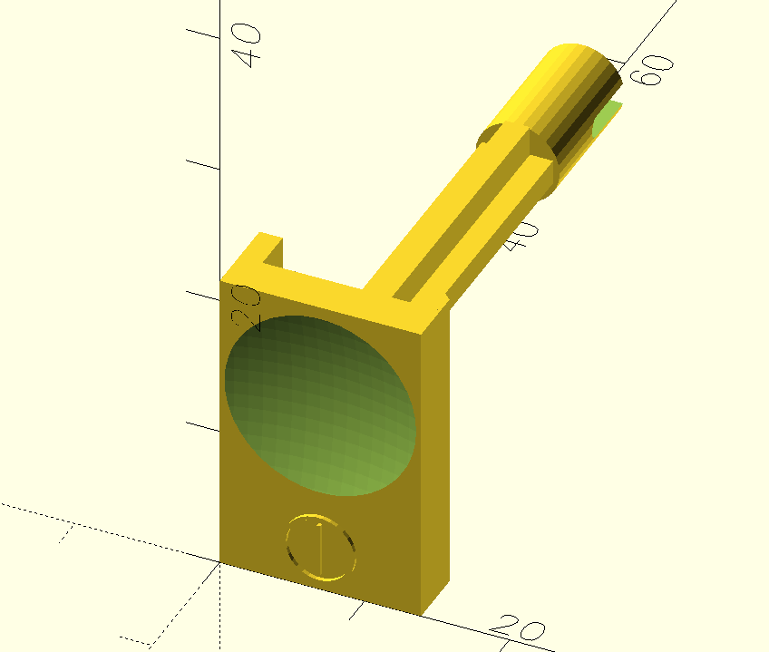

STLs
====

OpenSCAD and STL models of an Acorn Risc PC power button.

The OpenSCAD model is parameterised in numerous ways, e.g. to add a reinforced stem.

**Note**: I've not 3D printed and fettled / fine tuned this model as yet. It was measured from the real thing to an accuracy of 0.1mm but that's no guarantee that it'll work in its current state.

Related Models
---------------
RiscPC Spring Insert by Nic756655 <https://www.thingiverse.com/thing:6777776>
RiscPC Pegs 1 Slice by Nic756655 <https://www.thingiverse.com/thing:6776757>
Archimedes & RiscPC Half-Width Podule Slot Covers by distantcamera <https://www.thingiverse.com/thing:5325053>
Acorn RiscPC Power Switch by mcnewton <https://www.thingiverse.com/thing:2854144>
