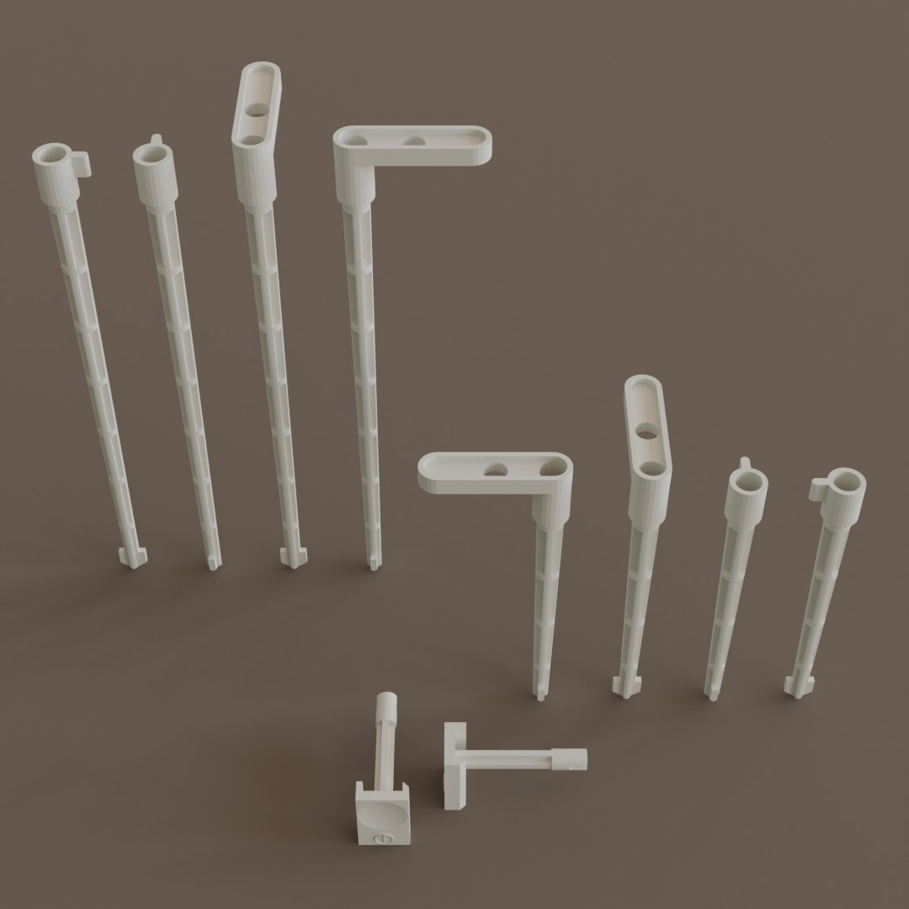
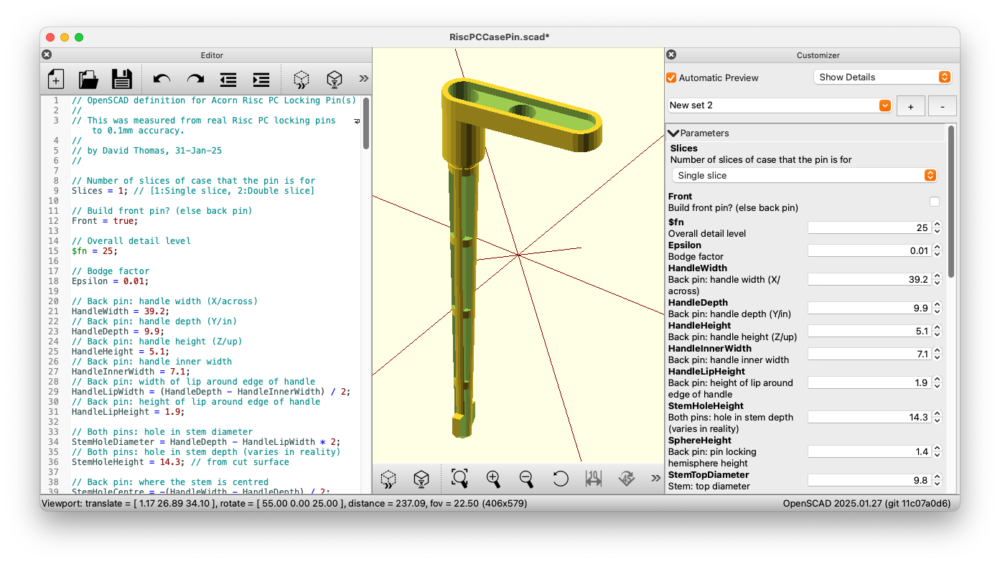

OpenSCAD/STL Acorn Risc PC Components
=====================================

This repository contains OpenSCAD sources and generated STL models of the Acorn Risc PC power button and case locking pins.

The OpenSCAD sources are provided. They're parameterised in numerous ways so you can tweak the models. e.g. you can increase the level of detail, or change the models in ways to make them amenable to your 3D printing preferences.

Notes
-----
1. The parts were measured and recreated to an accuracy of 0.1mm but I can't offer any guarantees other than that.
2. The originals are injection moulded and these models are a recreation of those parts. If you 3D print these models you may need to adjust these models for your chosen method (e.g. thickening or filling in parts).
3. While you can make three slice or larger case pins note that Acorn used very sturdy metal pins in those cases.

Related Models
--------------
RiscPC Spring Insert by Nic756655 <https://www.thingiverse.com/thing:6777776>  
RiscPC Pegs 1 Slice by Nic756655 <https://www.thingiverse.com/thing:6776757>  
Archimedes & RiscPC Half-Width Podule Slot Covers by distantcamera <https://www.thingiverse.com/thing:5325053>  
Acorn RiscPC Power Switch by mcnewton <https://www.thingiverse.com/thing:2854144>  
