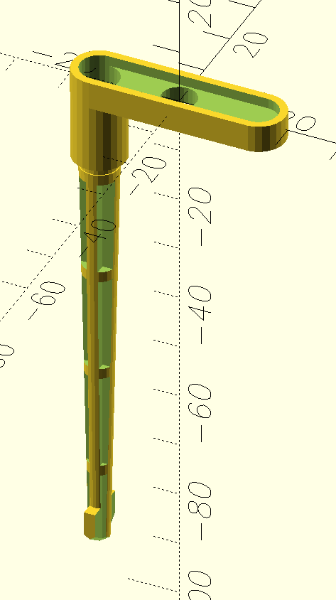

OpenSCAD/STL Acorn Risc PC Components
=====================================

OpenSCAD sources and generated STL models of the Acorn Risc PC power button and case locking pins.

The OpenSCAD sources are parameterised in numerous ways so you can tweak the models - within reasonable tolerances.

**Note**: I've not 3D printed and fettled / fine tuned these models as yet. They were measured from the real things to an accuracy of 0.1mm but that's no guarantee that they'll work in their current state.

Related Models
---------------
RiscPC Spring Insert by Nic756655 <https://www.thingiverse.com/thing:6777776>  
RiscPC Pegs 1 Slice by Nic756655 <https://www.thingiverse.com/thing:6776757>  
Archimedes & RiscPC Half-Width Podule Slot Covers by distantcamera <https://www.thingiverse.com/thing:5325053>  
Acorn RiscPC Power Switch by mcnewton <https://www.thingiverse.com/thing:2854144>  
